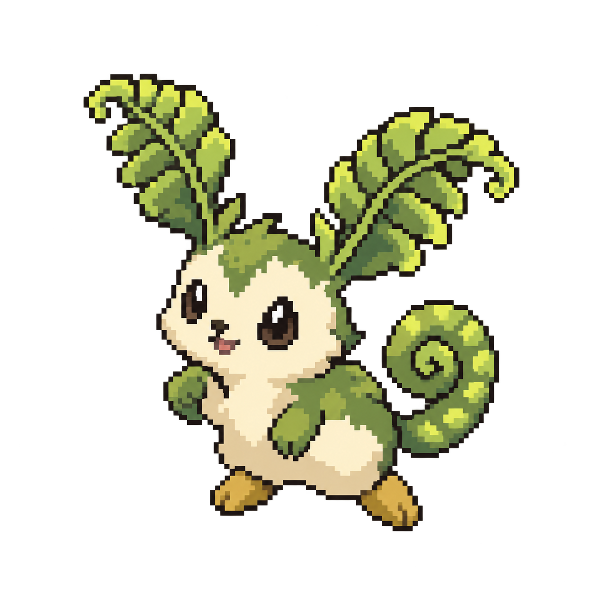
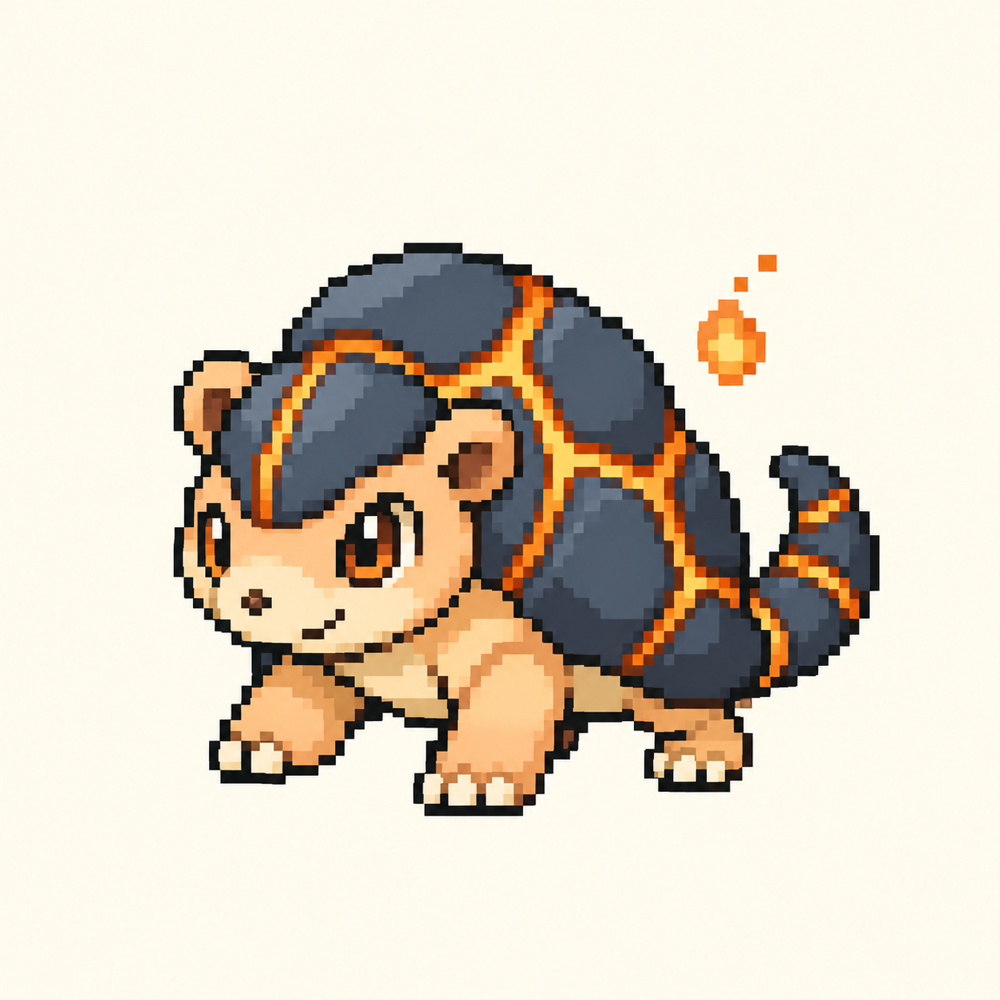
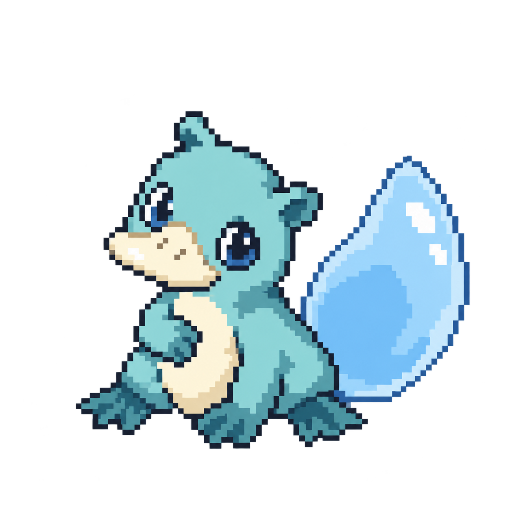
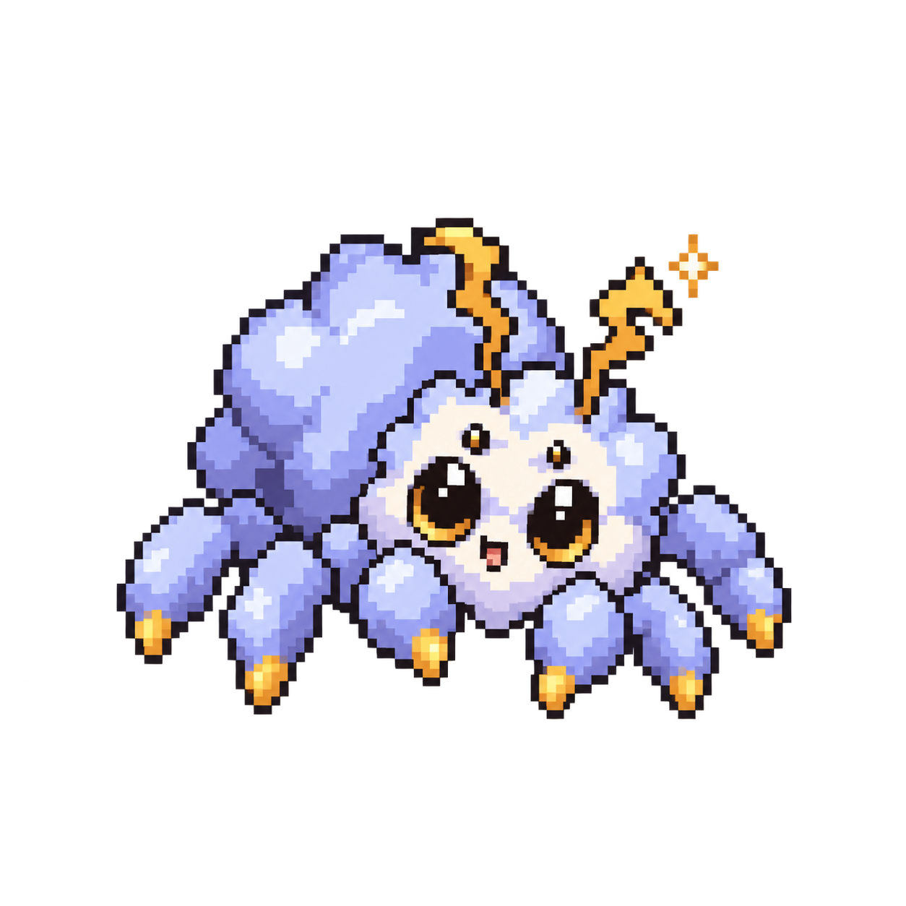
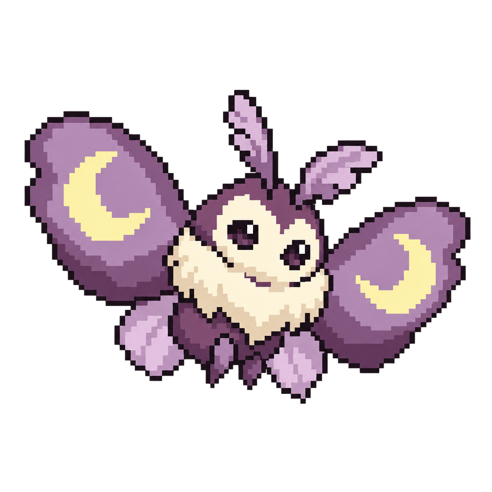

# Original creature concepts

The growing hero-and-face collection now lives in [resources/creature-design-v1](../../resources/creature-design-v1/README.md). [Open its visual gallery](../../resources/creature-design-v1/index.html) for the full roster and small-icon previews.

Five exploratory **pixel-art** designs for a future original PokeTaskBar collection.

[Read the replacement plan in Linear](https://linear.app/spawn-audio/document/original-creature-collection-future-replacement-plan-b3c3f8193942) · [Local plan](plan.md) · [Generation prompts](mockups/prompts.md)

| Concept | Affinity | Defining feature |
| --- | --- | --- |
| [Mosskip](../../resources/creature-design-v1/hero/01-mosskip.png) | Grove | Fern ears and a curled fiddlehead tail |
| [Cindillo](../../resources/creature-design-v1/hero/02-cindillo.png) | Ember | Armadillo armour with glowing amber seams |
| [Puddlepip](../../resources/creature-design-v1/hero/03-puddlepip.png) | Tide | Platypus-like body with a raindrop tail |
| [Voltuff](../../resources/creature-design-v1/hero/04-voltuff.png) | Spark | Fluffy storm-cloud jumping spider |
| [Noctuft](../../resources/creature-design-v1/hero/05-noctuft.png) | Dusk | Soft moth with crescent-marked wings |

These enlarged static concepts were generated using the built-in Image Generation tool, with two existing app sprites as pixel-rendering references. Names, proportions, and palettes are provisional. They are not animated assets or verified native-resolution sprites.

Production would begin with one two-stage family, a consistent native pixel grid, transparent exports, shared framing, and an idle animation tested at actual app sizes. The full plan covers the catalogue, art workflow, save migration, smaller-roster gameplay, packaging, and validation.

## Mosskip — Grove

## Cindillo — Ember

## Puddlepip — Tide

## Voltuff — Spark

## Noctuft — Dusk

