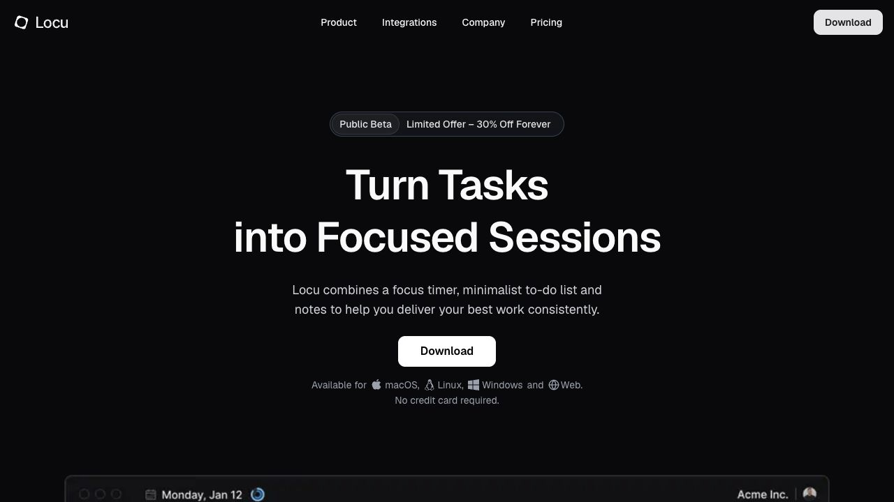

# PokeTasks v2 - Document Index

Source: [PokeTasks v2 - Document Index](https://linear.app/spawn-audio/document/poketasks-v2-document-index-d2ff2b22fc39)

**PokeTasks v2.0 is built and installed as a separate local experimental app.** Updated 2 October 2026. [First build, reset and validation notes](first-build.md). Earlier concepts below record the planning stage; native implementation evidence appears in the dated Linear feature documents.

## Direction

Preserve the current Issues, Projects, and Initiatives card appearance. Refine window/tab behavior: icon-only folded navigation, an independently folded timeline, rounded scroll viewports, useful context menus, and restrained hover/folding motion. Explore temporarily hiding Initiatives while retaining all code/data. Add Time Blocking, foldable Today / Soon / Later sections, and task time data/scores with a GitHub-style heatmap. Keep document/note syncing in the backlog.

**Linear remains the design foundation.** Use the existing [palette, typography, spacing and interaction language](<https://linear.app/spawn-audio/document/ui-overhaul-v2-foundations-and-shared-interaction-language-e25429d73e2c>). [Locu](<https://locu.app>) supplies the main planning/timer inspiration: closely follow its task-to-timeline composition and duration preview, while retaining PokeTasks' Linear-style shell.

The resting floating bar shows only title and time. On hover/focus, actions replace the title in the same space; bar width and clock position stay fixed. Keyboard/VoiceOver access remains available. **User-selected:** personal planning by default, with optional Today → In Progress / Soon → Planned / Later → Todo linking. Urgency/due dates stay separate, as does planned versus measured time.

## Feature documents

| Area | Owning document and outline |
| -- | -- |
| [Today / Soon / Later](<https://linear.app/spawn-audio/document/poketasks-v2-today-soon-and-later-286ed82cf2e7>) | Independently foldable groups; personal by default with user-selected optional status linking. |
| [Time Blocking](<https://linear.app/spawn-audio/document/poketasks-v2-time-blocking-861f5be0e815>) | Locu-inspired day timeline, drag/resize, keyboard scheduling, and focus handoff. |
| [Time Tracking, Scores & Heatmap](<https://linear.app/spawn-audio/document/poketasks-v2-time-tracking-scores-and-heatmap-380b5b2dabb3>) | Complete session retention, task/project reports, explained scores, and daily activity. |
| [Projects & Initiatives](<https://linear.app/spawn-audio/document/ui-overhaul-v2-workspaces-issues-projects-and-initiatives-f0f3fb690b50>) | Revised 1 October planning section; retain current cards, improve workspace behavior, and propose deferring visible Initiatives. |
| [Floating Timer & Pet](<https://linear.app/spawn-audio/document/ui-overhaul-v2-focus-and-floating-timer-fcd3495bbc65>) | Revised 1 October section; title/time at rest, actions overlay the title on hover/focus. |
| [Backlog & Open Decisions](<https://linear.app/spawn-audio/document/poketasks-v2-backlog-and-open-decisions-7d11e3b3d15f>) | Low-priority document/note syncing, open choices, and proposed delivery order. |

Projects/Initiatives and floating-timer material was added to the existing scoped documents, preserving their approved baselines. This avoids a second conflicting specification. This new app-v2 index is linked from [UI Overhaul v2](<https://linear.app/spawn-audio/document/ui-overhaul-v2-34ba3019297c>); that existing design index predates the new build plan.

## Animation mockup videos

[Watch the combined 66-second preview](motion/poketasks-v2-motion-preview.mp4), or open individual studies:

- [Workspace controls and folding — 22 seconds](motion/workspace-motion.mp4)
- [Today sections and timeline — 26 seconds](motion/today-timeline-motion.mp4)
- [Floating timer actions over title — 18 seconds](motion/floating-timer-motion.mp4)

Each includes normal-speed scenes, a marked quarter-speed replay, and Reduced Motion. These are planning concepts; the app is unchanged. [Scene notes and validation limits](motion/README.md).

## Mockups and reference assets

### Current revision — behavior around preserved cards

| Visual | Owning document |
| -- | -- |
| [poketasks-v2-preserved-projects-window.png](assets/mockups/preserved-projects-window.png) | [Workspaces](<https://linear.app/spawn-audio/document/ui-overhaul-v2-workspaces-issues-projects-and-initiatives-f0f3fb690b50>) |
| [poketasks-v2-foldable-today-planner.png](assets/mockups/foldable-today-planner.png) | [Time Blocking](<https://linear.app/spawn-audio/document/poketasks-v2-time-blocking-861f5be0e815>) |
| [poketasks-v2-timer-actions-over-title.png](assets/mockups/timer-actions-over-title.png) | [Focus & Floating Timer](<https://linear.app/spawn-audio/document/ui-overhaul-v2-focus-and-floating-timer-fcd3495bbc65>) |
| [Current app card/panel baseline](assets/references/current-projects-window.png) and [scroll cutoff defect](assets/references/current-scroll-cutoff.png) | [Foundations](<https://linear.app/spawn-audio/document/ui-overhaul-v2-foundations-and-shared-interaction-language-e25429d73e2c>) |

These images illustrate behavior and have generated styling/details that are schematic. The supplied current screenshot and existing native card components remain the exact card baseline. Do not rebuild card rendering from generated pixels. No mockup is installed-app validation. [Motion refinements](<https://linear.app/spawn-audio/document/ui-motion-and-animation-outline-c51cbefca508>) reuse the existing timing guidance.

### First-round explorations and Locu references

The three first-round concepts below are retained as history. Their flattened workspace cards and trailing-space timer controls are superseded by the revision above. All data is illustrative; none is an approved build target. The Insights concept remains exploratory and uses a schematic grid; its owning document requires seven weekday rows and one column per week.

| Visual | Owner |
| -- | -- |
| [poketasks-v2-quiet-day-planner.png](assets/mockups/quiet-day-planner.png) | Time Blocking |
| [poketasks-v2-linked-work-workspace.png](assets/mockups/linked-work-workspace.png) | Projects & Initiatives |
| [poketasks-v2-focus-insights.png](assets/mockups/focus-insights.png) | Time Tracking, Scores & Heatmap |
| [poketasks-v2-locu-timer-rest.png](assets/references/locu-timer-rest.png) | Floating Timer & Pet |
| [poketasks-v2-locu-timer-hover.png](assets/references/locu-timer-hover.png) | Floating Timer & Pet |
| [poketasks-v2-locu-project-task-buckets.png](assets/references/locu-project-task-buckets.png) | Today / Soon / Later |
| [poketasks-v2-locu-task-priorities.png](assets/references/locu-task-priorities.png) | Today / Soon / Later |
| [poketasks-v2-locu-time-block-resize.png](assets/references/locu-time-block-resize.png) | Time Blocking |
| [poketasks-v2-locu-today-planner.png](assets/references/locu-today-planner.png) | Time Blocking |
| [poketasks-v2-locu-time-insights.png](assets/references/locu-time-insights.png) | Time Tracking, Scores & Heatmap |
| [poketasks-v2-locu-website-2026-10-01.png](assets/references/locu-website-2026-10-01.png) | This index |

Every new visual is uploaded to Linear and embedded in its owning feature document, except the website capture below. The image uploads are also retained as supporting attachments on the existing project-organisation issue; its status was not changed.

Existing approved PokeTaskBar Projects, Initiatives and Usage references remain in the scoped documents. The user's current app screenshot now explicitly locks the card and content-panel appearance. The [deprecated planned-changes document](<https://linear.app/spawn-audio/document/ptb-planned-changes-deprecated-b5cfe5a487b7>) is historical inspiration only.

## Historical worktree and local planning source — 1 October 2026

* Worktree: `experiments/PokeTasks-v2` under the PokeTaskBar repository.
* Branch: `codex/poketasks-v2`.
* Base: local `origin/Master` at `c3c438b49037fbba9f7fea8c75cdaff8eed6428b`, including merged task-timer/floating-control work.
* Planning sources: `Documents/poketasks-v2/` in that worktree. Includes concise briefs, exact generation prompts, upload/document manifests, all nine supplied screenshots, the website capture, and six mockups across two planning rounds.
* Source files and the installed app were not changed for this planning exercise. No native build/test or live task-sync validation was run.

## Planning handoff — 1 October 2026 (historical)

The user's caveats and optional linked-mode choice are recorded. Confirm the temporary Initiatives deferral, decide team status mappings/reverse-sync behavior, and choose the first implementation slice. The [backlog](<https://linear.app/spawn-audio/document/poketasks-v2-backlog-and-open-decisions-7d11e3b3d15f>) proposes a small delivery order; reliable session retention must precede claims of complete historical tracking.
