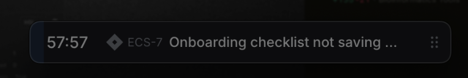
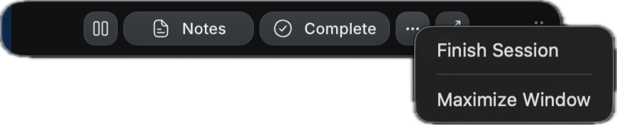
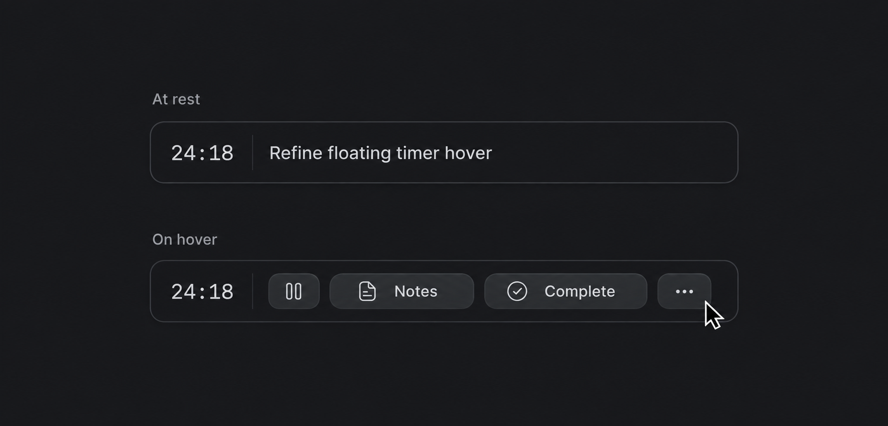

# PokeTasks v2 — floating timer refinements

Source: [UI Overhaul v2 - Focus & Floating Timer](https://linear.app/spawn-audio/document/ui-overhaul-v2-focus-and-floating-timer-fcd3495bbc65)

## PokeTasks v2 planning - Minimal floating timer & pet

**Planning proposal · 1 October 2026.** This is a new refinement brief, not approval of the generated concepts or a claim of implementation. Existing timing, completion, rewards, width/position, and accessibility rules above still apply.

### Requested change

The resting bar shows **only task title and time**, following the supplied Locu reference. Move the current issue identifier, New issue button, progress track, visible movement/resize chrome, and secondary controls out of the resting presentation.

### Proposed behavior

* Keep the current 42 pt starting height and saved width/scale. Stable monospaced time at the left; one-line task title in the remaining space. A standalone timer uses its existing session title.
* Hover reveals Pause/Resume, Notes, Complete, and More. Put +5 minutes, Finish session, Open Focus, New issue, attach/detach, pin, and pet options in More instead of showing every action at once.
* Keyboard focus and VoiceOver expose the same controls; pointer-only access cannot be the sole way to pause/finish. Controls remain revealed while their menu/composer is open.
* On hover/focus, fade out the title and overlay the action group within that exact title area. Do not reserve trailing space, widen the bar, or show illegible title/button overlap. The clock keeps its anchor and the bar keeps its bounds. Restore the title on exit after any open menu closes.
* At narrow saved widths, use compact icons and move secondary actions into More so controls fit without increasing the bar. Keep Pause/Resume reachable; expose full task title and action names accessibly.
* A subtle hover drag/resize cue replaces permanent grips. Preserve reachable on-screen bounds and saved preferences.
* Paused/overtime states use readable time treatment plus accessible state text; a time-up/check-in prompt remains available even while resting chrome is minimal.
* **Complete task** and **Finish session** remain distinct. Use existing eligibility/sync handling; finishing tracked work need not complete the Linear issue.
* Keep existing session notes/check-ins. This proposal does not depend on the low-priority document-sync backlog.

### Pet refinement

Keep the sprite crisp, proportional, and unboxed beside the timer. Reuse existing attached, detached/pinned, and pet-only behaviors. Keep celebrations and pet actions accessible, but avoid large decorative containers or pet motion that obscures the task/time. The pet can remain in its user-chosen position when the timer is detached.

### Visuals

The initial Day Planner and Linked Work Workspace concepts are retained as historical explorations. Their card restyling and trailing-space hover layout are superseded. The revised component study below shows equal-width rest/hover states with controls replacing the title; the current app components and supplied screenshot remain the visual baseline.

Two states of the same component: equal bar bounds and clock position; actions replace the title area. The image illustrates behavior; retain the existing height, saved widths/scales, and current rendering materials during implementation.

### Required future checks

Verify rest/hover/focus/menu/paused/time-up states, identical bar bounds and clock anchor, title restoration, fitting actions at supported saved widths/scales, keyboard and VoiceOver access, Increased Contrast, Reduced Motion, multi-display bounds, saved position/size, standalone sessions, and existing reward/completion paths. No native behavior was changed or tested in this planning task.

Related planning: [Time Blocking](<https://linear.app/spawn-audio/document/poketasks-v2-time-blocking-861f5be0e815>) and [preserved Workspaces](<https://linear.app/spawn-audio/document/ui-overhaul-v2-workspaces-issues-projects-and-initiatives-f0f3fb690b50>). Document syncing is a separate backlog item.
