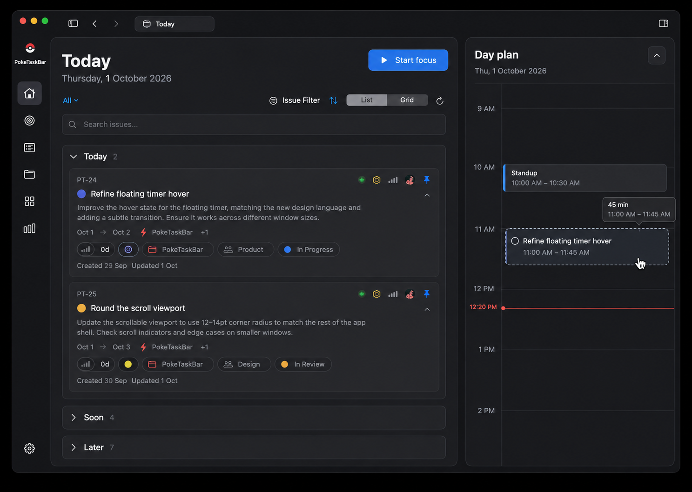
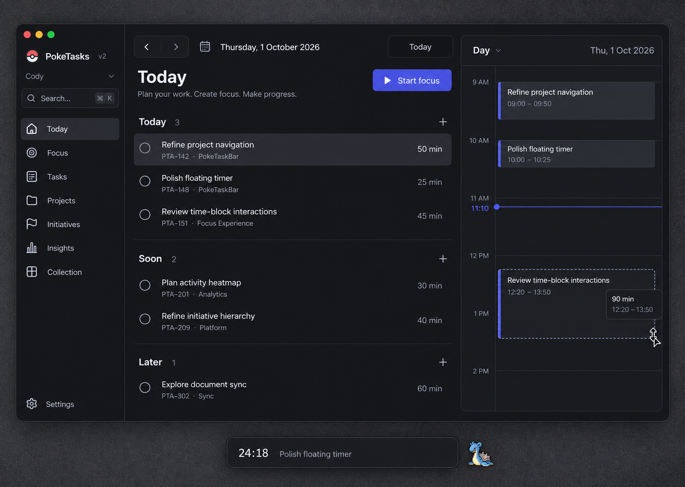
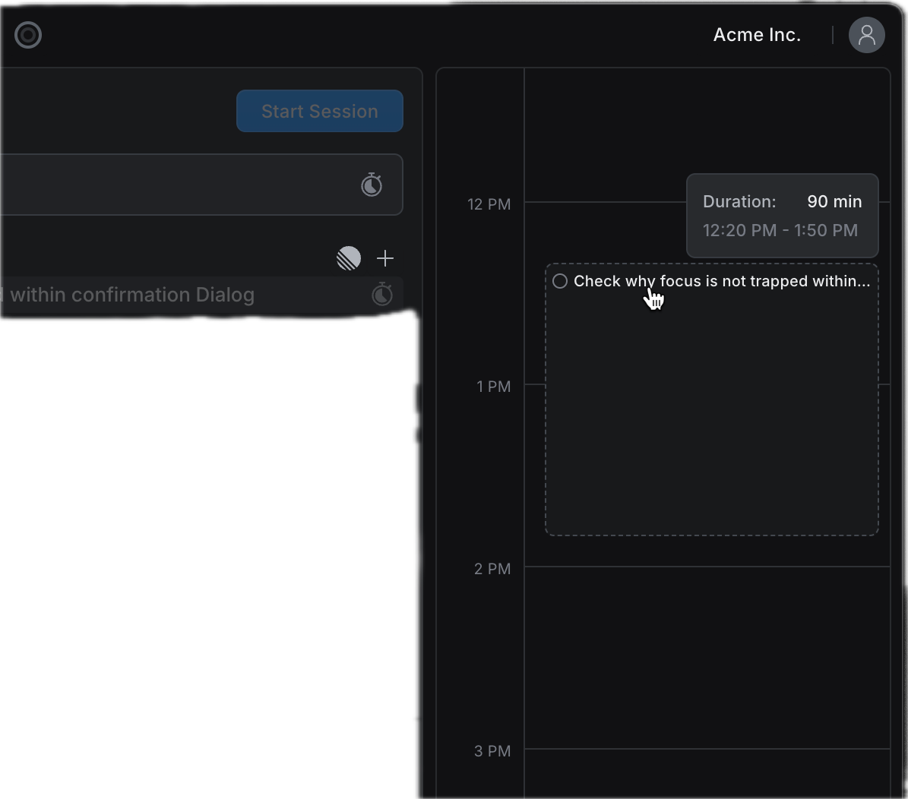
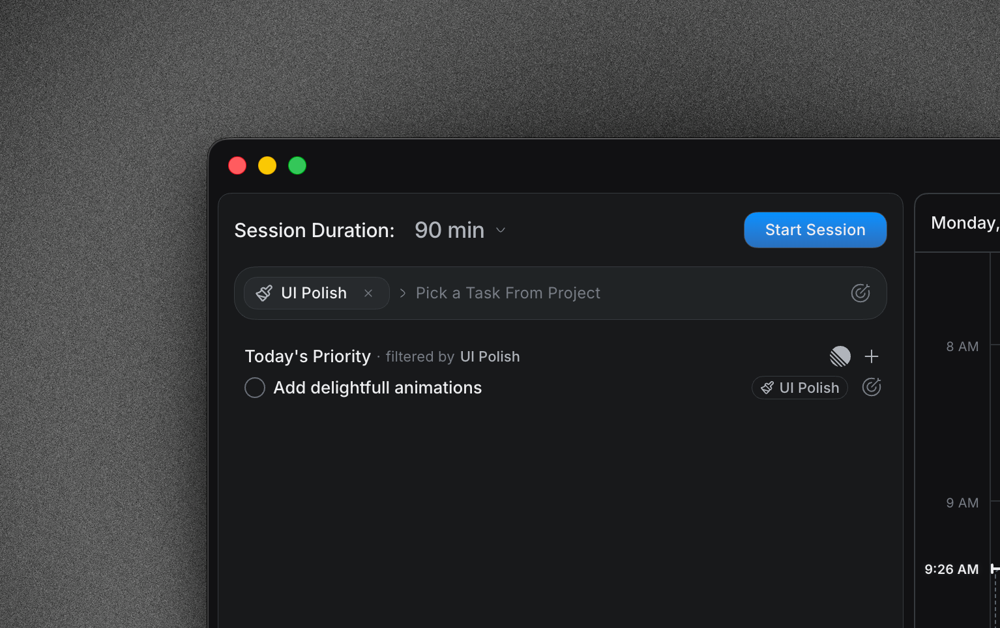

# PokeTasks v2 - Time Blocking

Source: [PokeTasks v2 - Time Blocking](https://linear.app/spawn-audio/document/poketasks-v2-time-blocking-861f5be0e815)

**Status: planning proposal · 1 October 2026.** Closely follow Locu's task-to-timeline composition, drag preview, and duration feedback, using PokeTasks' Linear visual language.

## The idea

Today's foldable task sections on the left, a vertical day timeline in its own rounded content panel on the right. Keep the existing issue card design. Reserve time for a task, then start the existing focus timer when ready.

## The main flow

1. Select a task in Today, Soon, or Later.
2. Drag it onto the timeline. A dashed preview follows the pointer and displays the start/end time and duration.
3. Drop to save the block. Drag its body to move it; resize its lower edge to change the duration.
4. Select the block and choose Start focus. This opens the existing duration picker and session flow; it does not automatically start because the clock reached the scheduled time.
5. When the session ends, show recorded time separately from the original plan.

## Layout and behavior proposals

* Fold the time-blocking panel independently using its header/chrome toggle or Show / Hide timeline in the context menu. Preserve its preferred width, selected date, scroll position, and saved blocks. Closing it never changes a timer or task status.
* Left navigation folds into an icon rail; its labels disappear but destinations and tooltips remain. Reuse the existing window layout/persistence. The timeline and left navigation each restore without resetting the other.
* Keep both content panels inset, with the current shell/tab design, matching rounded viewport corners, and visible gutters. Essential Start focus and Schedule actions remain reachable when the timeline is closed.
* Thin hourly guides, a quiet current-time line, neutral task blocks with a small accent edge, and generous empty space. Match the supplied Locu resize tooltip closely.
* Use 5-minute snapping for the first slice. Show precise start/end times while dragging; a Schedule dialog supports keyboard entry and exact edits.
* Use the existing planned task duration when available, otherwise the last-selected focus duration. The block and focus timer remain separate: resizing a block never changes an active session.
* Store one local block with its ID, task/issue ID, selected date, start/end instants, and display time zone. Distinguish planned blocks from actual session records.
* Permit several blocks for the same task. Rescheduling edits the block instead of duplicating it. Deleting a block does not delete the task, its tracked time, or a Linear issue.
* The first slice rejects overlapping local focus blocks with a clear conflict preview; offer another time instead of silently shifting the rest of the day.
* Undo supports create, move, resize, and remove. Escape cancels a drag. Pointer exit, window resizing, and relaunch must not lose saved blocks.
* Missed blocks become past plans that can be rescheduled. No automatic failure score or catch-up debt.
* One active focus session continues to be enforced through the existing session store. Starting another task retains the existing switch/forfeit confirmation.
* Light/dark, keyboard scheduling, readable status text, Reduced Motion, and Increased Contrast are part of the first usable slice.

## Keep the first version small

Start with an editable day view and local blocks linked to existing tasks. Explore week view, calendar overlays, recurring blocks, and calendar write-back only after the day flow works. Existing app duration limits still apply to focus sessions; a longer planning block need not bypass them.

## Checks required before implementation can be called complete

* Drag, move, resize, keyboard edit, Undo, conflict feedback, and persistence.
* Planned and recorded minutes remain separate; pauses do not count as work.
* Starting/stopping a session from the timeline cannot duplicate time or rewards.
* Midnight, time-zone changes, and daylight-saving transitions preserve the intended day and correct elapsed time.
* Narrow windows can fold the timeline into a visible reopen control; reopening may temporarily show Timeline in the available content area. Preserve the icon rail and readable task cards instead of shrinking them. Confirm the final fallback at the existing minimum window size.

## Mockup and references

### Revised foldable planner

Illustrative layout study: Today is open, Soon/Later are folded, icon navigation remains, and the timeline has its own fold control. Generated issue fields/icon treatments are schematic; reuse the current issue component unchanged. Visible status badges show personal mode and do not establish the proposed automatic mapping.

### Initial concept — superseded card treatment

The following first-round image is retained as an earlier exploration. Its simplified flat task presentation is superseded by the current issue-card baseline.

### Supplied Locu references

The dashed preview and tooltip are a visual behavior illustration; no working timeline has been implemented in this planning task.

Reference: [Locu](<https://locu.app>). Shared styling follows [Foundations & Shared Interaction Language](<https://linear.app/spawn-audio/document/ui-overhaul-v2-foundations-and-shared-interaction-language-e25429d73e2c>).

## 2 October 2026 — Smoother timeline dragging

Block moves and lower-edge resizing now follow the pointer continuously, then settle onto the five-minute grid on release. Both use the stationary timeline canvas, fixing inconsistent distance and direction changes. The short settling animation respects Reduced Motion; conflict rejection, Escape and Undo retain their existing behavior.

Dashed issue-drop previews also follow the pointer continuously. Native checks confirm that dropping an issue creates the intended block, rejects overlaps and supports Undo. The timeline's hour targets and restoration order were corrected so scrolling to another hour survives folding and reopening the panel.

[Validation and rebuilt-app evidence](https://linear.app/spawn-audio/document/ui-overhaul-v2-implementation-validation-and-change-log-5bdfd7d37c11).
