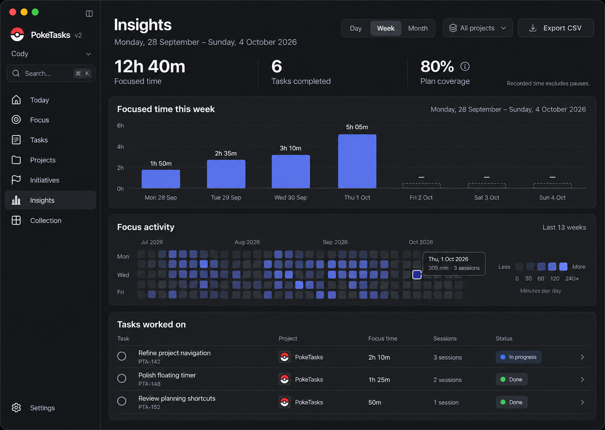
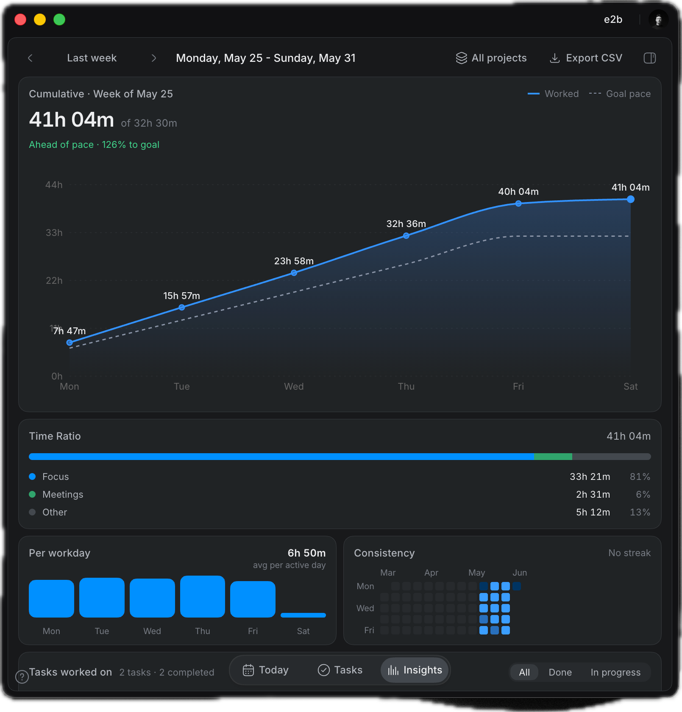

# PokeTasks v2 - Time Tracking, Scores & Heatmap

**Status: planning proposal · 1 October 2026.** Track actual task time and make it easy to review, with a GitHub-style activity heatmap and transparent scores.

## What the page should answer

- Where did my focus time go?
- Which tasks and projects did I work on?
- How did recorded work compare with my plan?
- When did I find time to focus?

Use the shared Linear shell and quiet charts. Task Insights should remain separate from AI token Usage; token consumption is not task time or a productivity score.

## First useful page

- Day / Week / Month period controls and task/project filtering.
- Actual focus time, completed tasks, and an optional explained plan-coverage percentage.
- Daily/cumulative work chart with planned and actual time clearly labelled. Future days have no recorded value.
- GitHub-style contribution grid: one cell per local date, intensity by recorded focus minutes. Begin with 13 weeks; a year view can follow.
- A task table showing identifier/title, project, recorded minutes, number of sessions, and current completion state. Selecting a task reveals its session history.
- CSV export of session records. PDF reports and meeting categories can follow later.

## Honest data comes first

**Current code finding:** `FocusSessionStore.recordHistory` removes the previous history entry for an issue before saving the latest one. `FocusIssueHistory` has a 200-entry cap. That storage is suitable for a latest-session summary, not a complete time-tracking ledger. The existing active clock also already handles pause/sleep accounting.

Before building historical reports, retain a local session record for every finished/stopped session: unique session ID, task/issue ID, title/project snapshot when known, actual active segments, finish reason, and the existing reward result. Reuse the current session clock; do not create a second timer or reward engine.

- Preserve interrupted/stopped work as time even when the task remains incomplete. Finish reason and task completion are separate.
- Include only measured active time. Exclude pause, sleep, and waiting-for-choice intervals using existing accounting. Do not infer work from how long the app is open.
- Split active segments at local midnight for daily charts; an overnight session cannot assign all minutes to its finish date.
- Use stable session IDs to make persistence/relaunch idempotent. One session contributes once, regardless of how many screens display it.
- Preserve title/project snapshots when an issue is renamed, moved, unavailable, or deleted. Describe whether a project report uses the recorded or current project.
- Import only recoverable retained history. Label partial legacy records honestly; do not invent lost sessions or pretend older heatmap gaps are zero-work days.
- Export timestamp/time-zone context and actual seconds; round only display values. Running-session contributions are provisional until settled.

## Scores worth exploring

| Measure | Proposed definition | Boundary |
| --- | --- | --- |
| Focus time | Sum of measured active seconds | No idle/app-open minutes. |
| Task completion | Distinct tasks completed in the selected period | Several sessions do not mean several completed tasks. |
| Plan coverage | Sum of actual minutes linked to each block, capped at that block's planned duration, divided by total planned minutes | Optional; no plan means no score. Prevent double attribution across blocks. |
| XP / Coins | Existing rewards earned from the session records | Keep separate from time and planning scores; no new reward formula. |

Avoid an unexplained composite productivity number. Optional targets should be adjustable; no streak penalties, shame labels, or rewards for exceeding a healthy workday. The exact score design remains open for the user.

## Heatmap behavior

Use neutral empty cells and restrained accent shades with a labelled minute-based legend. Proposed bands: 0, under 30, 30–59, 60–119, and 120+ minutes. Missing history and future dates use distinct unavailable/disabled states. Hover or keyboard focus shows the full date, minutes, and sessions; selecting a date opens the daily detail. Do not rely on color alone.

## Mockup and reference

Illustrative week: Monday 28 September–Sunday 4 October 2026, with Thursday 1 October as today. Future days must remain empty. Mock totals and scores are examples, not measured user results.

**Visual review note:** the generated heatmap is schematic and does not render the exact 13-week / seven-day geometry. Implementation must use seven weekday rows, one column per week, a correctly aligned selected date, and distinct missing/future cells. Its illustrative 80% plan coverage means 4h of block-linked work against 5h planned; it is independent of the example's 12h 40m total focus time.
