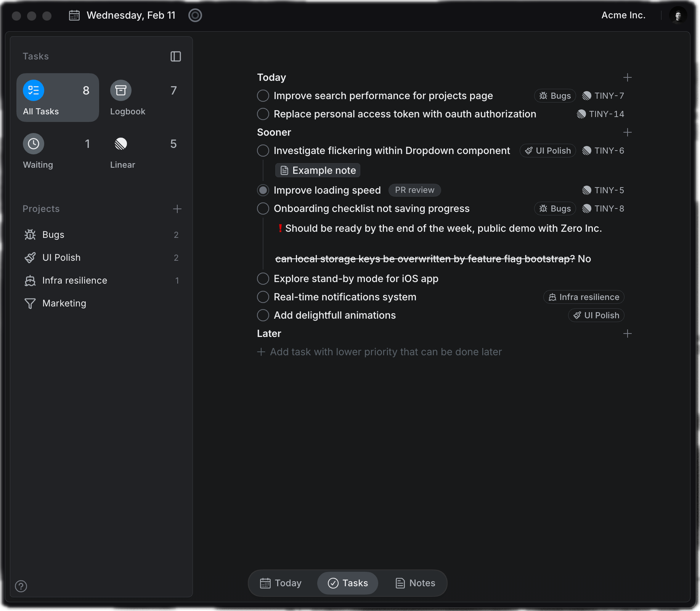
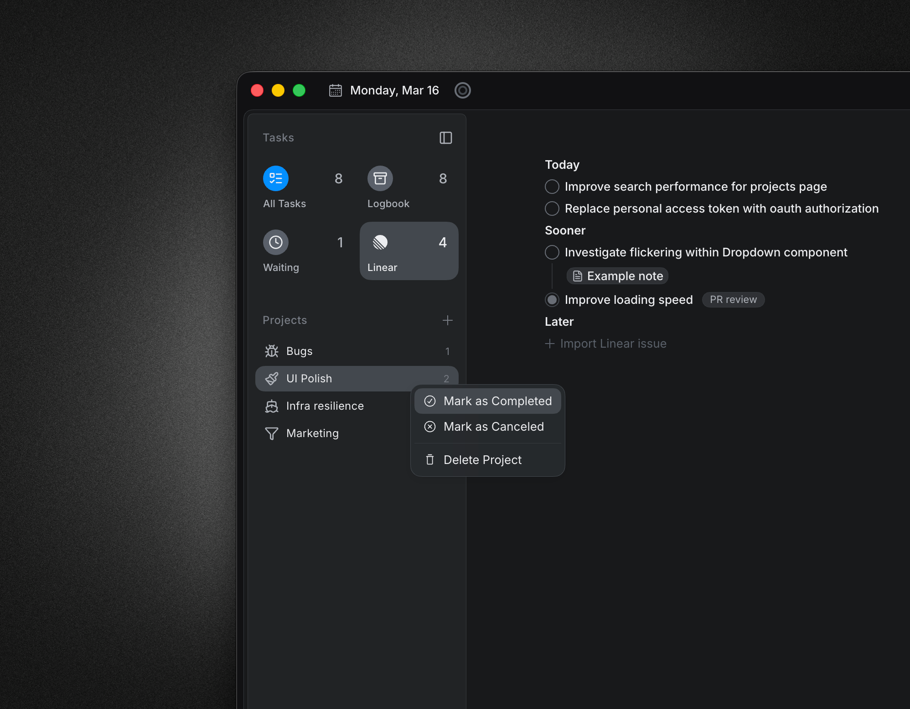

# PokeTasks v2 - Today, Soon & Later

Source: [PokeTasks v2 - Today, Soon & Later](https://linear.app/spawn-audio/document/poketasks-v2-today-soon-and-later-286ed82cf2e7)

**Status: planning · revised 1 October 2026.** User-selected direction: personal planning by default, with an optional linked status mode. Foldable sections are required. Implementation details below remain proposed; no issue statuses were changed.

## The idea

Choose what deserves attention now using three stacked, foldable sections inspired by Locu. Keep the existing Linear-style issue cards and window panels. Planning can remain local; an optional linked mode could also update Linear status.

| Group | Proposed meaning |
| -- | -- |
| Today | Tasks intentionally chosen for the day being viewed. |
| Soon | Ready work to consider next; no fixed date or automatic deadline. |
| Later | Work deliberately parked until it becomes relevant. |

## Layout and interactions

* Reuse the current issue card rendering, including its identifier, status, title, metadata chips, corner treatment, and expand/minimize controls. Refine behavior around the cards rather than restyling them.
* Today, Soon, and Later each fold independently. A folded header retains its name, count, disclosure control, and drop target; hovering a dragged task can temporarily open it. Keep fold state across navigation/relaunch. Folding changes presentation only.
* Section/background context menus offer Fold all / Unfold all for these three groups, ordering options, and Show / Hide timeline. Issue menus offer Move to Today / Soon / Later and Schedule; keyboard alternatives use the same actions.
* Drag to reorder within a group or move between groups. A task menu provides the same actions without dragging.
* Today can show the task list alongside the day timeline. The full Tasks page shows all three groups; project filters reveal the same assignments.
* Selecting a task exposes Start focus and Schedule. Keep inline descriptions collapsed until requested.
* Use the exact label **Soon**, even though some Locu references say Sooner.
* Keep the companion small during planning; collection and celebration remain accessible through existing routes.

## Proposed rules

* Store the planning group, selected day, and order locally against the stable task/Linear issue ID. Linear continues to own title, status, urgency, project, and due date.
* Planning group and Linear urgency stay separate. Moving an issue never rewrites priority or due date. In personal mode, moves do not change Linear status. The optional linked-mode proposal below is the only proposed status-writing path.
* New imported issues remain unplanned until selected; do not automatically fill Today with the whole workspace.
* Multiple time blocks may reference one task, but the task appears once in its planning group.
* Completing a Linear task uses the existing completion path and removes it from active planning groups. Unavailable/deleted issues retain historical time records and show their sync state.
* At day change, offer a brief review of unfinished Today tasks: keep for today, move to Soon, or move to Later. Do not silently reshuffle them or build a growing overdue list.
* A due-date cue stays visible even in Later; planning does not rewrite deadlines. Scheduling a task for the viewed date proposes adding it to that day's Today list, with Undo.
* Local tasks remain a possible extension; the first slice can use existing Linear tasks and the existing standalone focus timer.

## Optional Linear status mapping — selected direction

| Move destination | Requested Linear status |
| -- | -- |
| Today | In Progress |
| Soon | Planned |
| Later | Todo |

**User choice:** personal planning is the default; enable status linking explicitly. When enabled, the mapping above could remove a separate status-edit step, but selecting several tasks for Today marks them all In Progress before focus actually starts. Later becomes a real workflow change rather than only a parking place.

Proposed linked-mode requirements:

* Resolve actual workflow status IDs per team. Do not assume every team has statuses with these names; leave linking off for a team until its mapping is valid.
* Apply status changes only after an explicit group move, never on folding, scrolling, date rollover, enabling the mode, or importing a workspace.
* Keep completed/canceled issues outside the active groups; do not reopen them automatically.
* Show a pending/failed sync result and Retry. Undo restores the prior group and attempts to restore its prior status; a failed remote restore stays visible.
* Preserve local group order. No bulk rewriting of existing issues when the mode is enabled. Reuse the current Linear mutation path rather than adding a second sync engine.

No live Linear issue has been moved or modified during planning.

## Decisions to resolve

1. Resolve each team's actual workflow mappings before enabling linked mode. Personal planning by default with optional linking is confirmed.
2. Should Today have an optional suggested limit or remain unlimited? Proposed: no hard cap; show planned minutes for capacity awareness.
3. In linked mode, should status changes made directly in Linear also regroup issues? Proposed first slice: explicit moves write status; remote changes refresh the badge and flag a mismatch without silently moving the user's plan.
4. Should unfinished Today tasks carry automatically? Proposed: user-controlled review; rollover never updates Linear status.

## Mockup and source references

[View the shared Day Planner mockup and scheduling interactions](<https://linear.app/spawn-audio/document/poketasks-v2-time-blocking-861f5be0e815>).

The mockup shows proposed grouping and the shared Today planner. All task names, counts, and values are illustrative. Scheduling interactions belong in the Time Blocking document.

Shared visual rules: [Foundations & Shared Interaction Language](<https://linear.app/spawn-audio/document/ui-overhaul-v2-foundations-and-shared-interaction-language-e25429d73e2c>).

## 2 October 2026 — Vertical issue status groups

This replaces the status-subtab direction from the previous revision. Below the shared Today / Soon / Later panel and divider, Issues now uses three vertical sections: **In Progress**, **Planned**, **Todo**. Each has a count and independent disclosure, matching the main prioritisation groups. Fold all / Unfold all includes both areas.

The tray retains the existing Linear issue cards, search/project filters, parent/sub-issue hierarchy and drag actions. Drag from any group into a personal priority or onto the timeline. Status-group folding stays separate from priority-group folding and remains available while navigating this window. Personal planning remains the default; optional linked moves retain the documented rules above.

Native fixture previews of the implemented layout:

[Validation and rebuilt-app evidence](https://linear.app/spawn-audio/document/ui-overhaul-v2-implementation-validation-and-change-log-5bdfd7d37c11).
