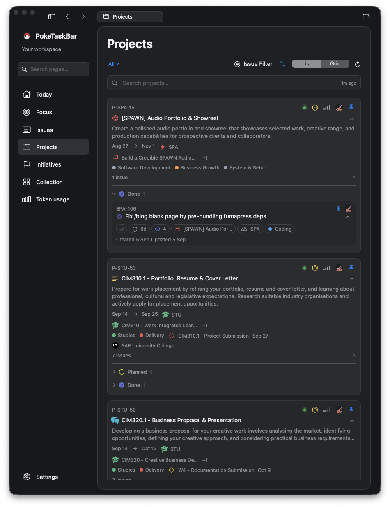
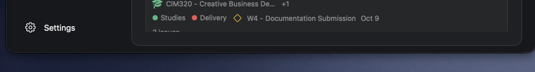

# PokeTasks v2 — window behavior refinements

Source: [UI Overhaul v2 - Foundations & Shared Interaction Language](https://linear.app/spawn-audio/document/ui-overhaul-v2-foundations-and-shared-interaction-language-e25429d73e2c)

## PokeTasks v2 planning — window behavior refinement, 1 October 2026

**User direction:** keep the current Issues, Projects, and Initiatives card design. The refinement concerns the surrounding window/tab behavior. The supplied current app screenshot is the card/panel baseline; earlier v2 concepts that flatten these cards are superseded.

### Panels and scrolling

* Keep the current native window controls, page tab/pill, inset rounded content canvases, quiet outlines, and outer gutters.
* Left navigation folds to an icon rail, retaining active selection, destination labels via tooltips/accessibility, Search, and Settings. The independently foldable right timeline has a visible reopen control. Restore widths without resetting page, filters, selected task, or focus session.
* Match rounded clipping at the actual scroll viewport as well as the surrounding panel. A rounded background behind a rectangular ScrollView is insufficient: scrolling cards must disappear through a continuous rounded boundary, with consistent inner spacing.
* During implementation inspect the shared canvas clipping and each page's scroll container; fix the responsible layer and check sibling pages. Keep existing card corner shapes unchanged.
* Verify partial cards at the top/bottom, both appearances, narrow/expanded windows, sidebar changes, and scroll indicators. This is a planned correction, not a delivered fix.

### Context menus that reduce clutter

| Menu scope | Useful additions |
| -- | -- |
| Today/Soon/Later section or background | Fold all / Unfold all sections; ordering; Show / Hide timeline. |
| Projects background | Fold all / Unfold all currently filtered projects; existing sort choices; List / Grid; optional Show / Hide descriptions. |
| Project/status group | Fold / Unfold this project or its issue groups; existing pin/open actions. |
| Issue card | Existing issue actions plus Move to Today / Soon / Later, Schedule, and Start focus when eligible. |
| Window/panel background | Collapse / Expand navigation; Show / Hide timeline; restore normal layout. |

Bulk folding affects the current visible/filter scope, preserves selection, and writes no Linear data. Show checked current view/order options. Context menus reuse the same commands as visible buttons and keyboard access. Preserve the user's existing defaults; a compact-content option uses current disclosures rather than a new card design.

### Hover and discoverability

Secondary utilities may appear when the pointer approaches their reserved hit region or when keyboard focus enters it. Keep hit regions stable and avoid layout jumps. Controls remain visible during menus/dragging. Preserve visible disclosure affordances, primary actions, selected state, and the way to reopen a panel. Keyboard and VoiceOver users can reach every action without a mouse.

Use the existing [motion outline](<https://linear.app/spawn-audio/document/ui-motion-and-animation-outline-c51cbefca508>) for folding and reveal timings.

### User-supplied baseline and defect

Revised panel behavior is illustrated in [Workspaces](<https://linear.app/spawn-audio/document/ui-overhaul-v2-workspaces-issues-projects-and-initiatives-f0f3fb690b50>) and [Time Blocking](<https://linear.app/spawn-audio/document/poketasks-v2-time-blocking-861f5be0e815>).
