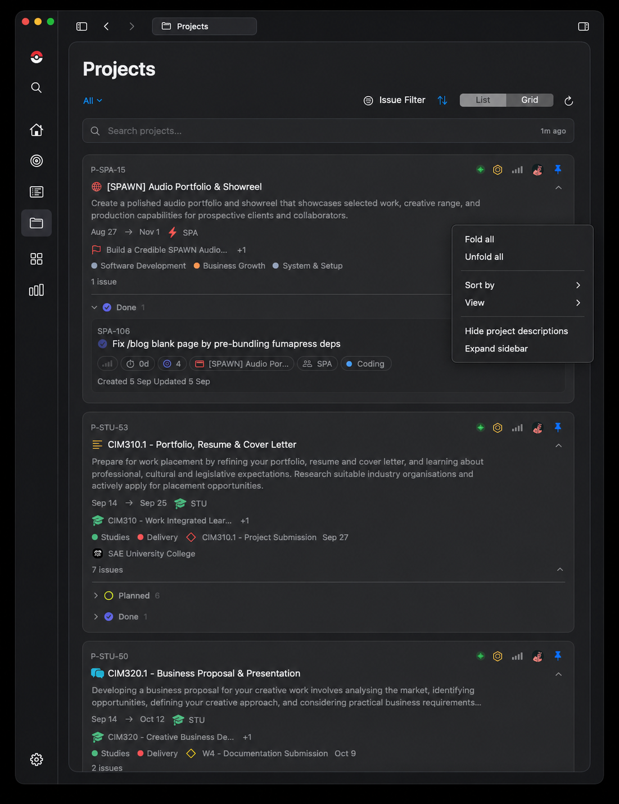
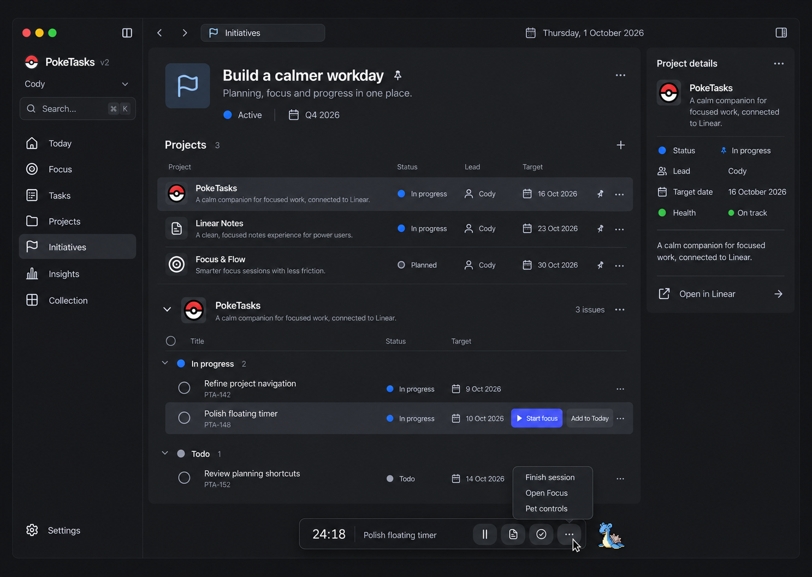

# PokeTasks v2 — workspace refinements

Source: [UI Overhaul v2 - Workspaces: Issues, Projects & Initiatives](https://linear.app/spawn-audio/document/ui-overhaul-v2-workspaces-issues-projects-and-initiatives-f0f3fb690b50)

## PokeTasks v2 planning - Preserve cards; improve workspace behavior

**Revised user direction · 1 October 2026.** Keep the currently implemented Issues, Projects, and Initiatives card appearance and content hierarchy. Refinement is about how the surrounding window/tab works. This supersedes the initial v2 suggestion to flatten cards into compact rows.

### Improvements with a practical benefit

* Keep current List/Grid, search, filters, status groups, pin/minimize, and nested issue presentation. Improve their discoverability without adding a second browser.
* Preserve each page's search, filters, selected project, fold state, and scroll position when navigating/backtracking. Existing navigation retention is the starting point.
* Add scoped Fold all / Unfold all and existing Sort / View choices to right-click menus. Bulk actions affect only currently filtered items; they do not change issue/project status.
* Offer a menu option to hide descriptions or fold issue details using existing component disclosure behavior. Keep the current expanded presentation as the default.
* Retain accessible primary controls. Secondary utilities may reveal on pointer proximity/keyboard focus in fixed bounds. Use the shared [window/context-menu rules](<https://linear.app/spawn-audio/document/ui-overhaul-v2-foundations-and-shared-interaction-language-e25429d73e2c>) and [motion outline](<https://linear.app/spawn-audio/document/ui-motion-and-animation-outline-c51cbefca508>).
* Rounded viewport clipping applies around scrolling content; changing the card design is unnecessary.

### Initiatives in v2 — proposed temporary deferral

Hide the Initiatives destination and entry points for now; retain its code, models, integration, preferences/pins, and current visual design. Reintroducing it later should reuse that implementation. A stale hidden destination falls back to Projects. Keep useful initiative metadata already in project cards unless separately hidden. No initiative or project data is deleted. [Backlog and scope decision](<https://linear.app/spawn-audio/document/poketasks-v2-backlog-and-open-decisions-7d11e3b3d15f>).

### Planning integration

Project filters reveal Today / Soon / Later assignments for the same issue IDs. Personal mode changes the plan only; the user selected personal planning by default with optional Today → In Progress / Soon → Planned / Later → Todo linking; detailed team mapping and reverse-sync behavior remain open in the [priorities brief](<https://linear.app/spawn-audio/document/poketasks-v2-today-soon-and-later-286ed82cf2e7>). Never start a timer for a whole project or initiative.

### Revised mockup

Illustrative panel/menu study. Preserve the supplied current app cards as the exact visual baseline; reuse their rendering rather than recreating typography or borders from generated pixels. The image is not native runtime validation.

### Initial concept — superseded

Retained for historical comparison only. Its flattened issue/project rows and visible Initiatives screen are superseded by the current v2 direction. The supplied current app screenshot in Foundations remains the card/panel baseline.

### Required future checks

Verify existing pin persistence/completion clearing, expand/minimize restore, filtered Fold all scope, search/sort/List/Grid, retained navigation/scroll context, hidden Initiatives entry points with stored data intact, rounded scrolling boundaries, missing/partial data, sync failure/retry, narrow windows, keyboard/VoiceOver access, and light/dark/contrast. No app source or installed behavior changed during planning.
